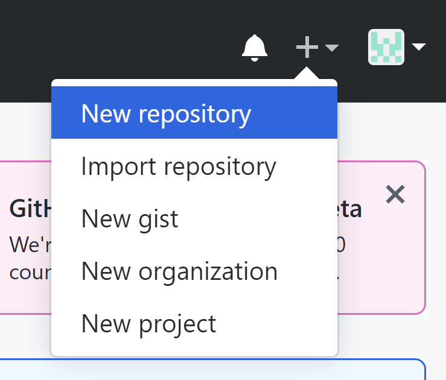
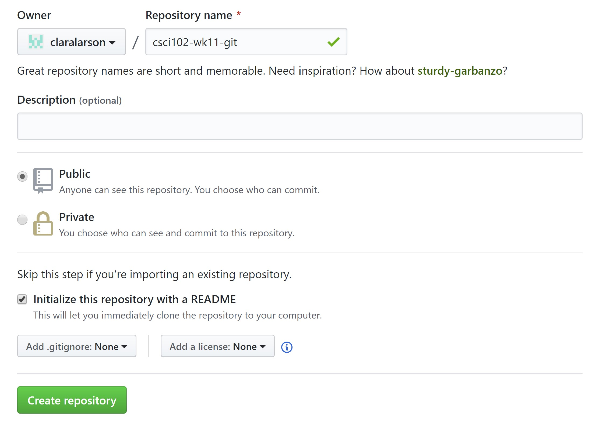
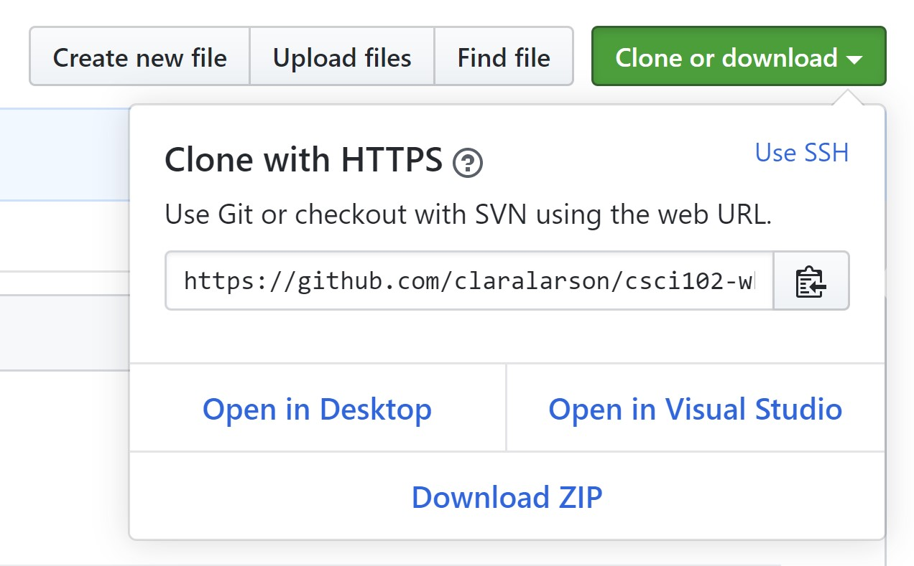
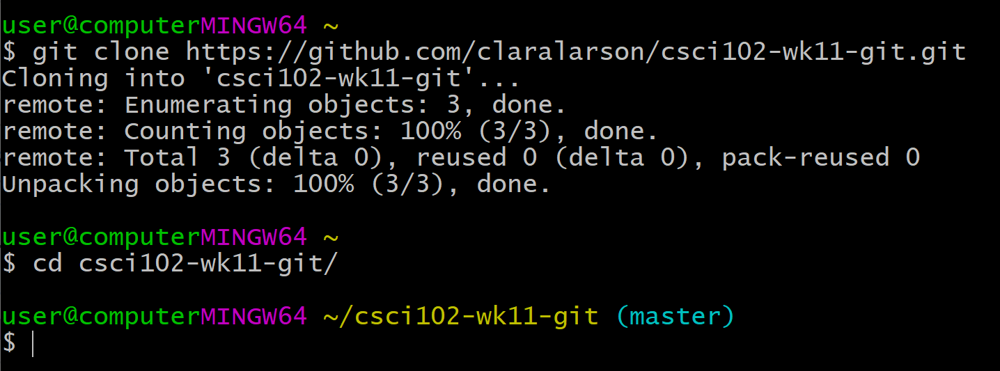
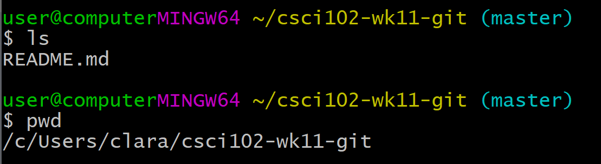
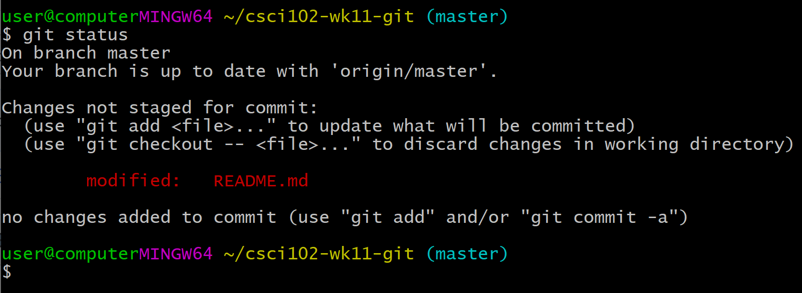
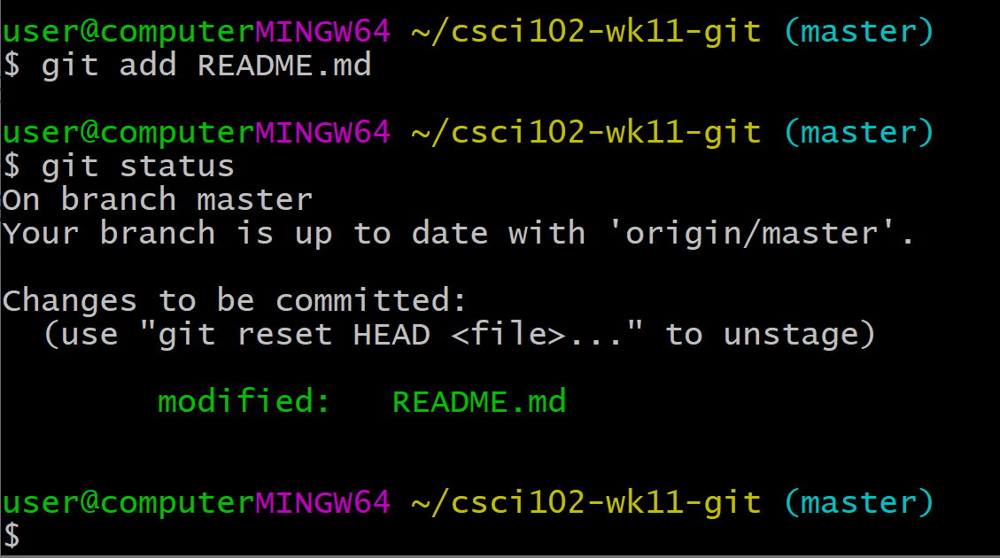

# Git Workshop Week 1 🚀
`git` is an extremely powerful tool that is used as a form of version control during the software development lifecycle, in laymen terms--it's how software is created in the real world. During week one of the tutorial we will learn all of the basic commands of `git` that you will need in order to keep track of your code for your school projects. Specifically, in this tutorial we will be covering: 
- How to create a repository on GitHub
- How to clone a remote repository to your computer (`git clone`)
- How to create a README
- How to create a file
- How to stage a file for a commit (`git add`)
- How to create a commit using (`git commit`)
- How to push up files to the remote repository (`git push`)

## Creating a repository on GitHub
Whenever you're starting a new project whether for school or for personal use, one of the first steps you should take is creating an empty repository on your remote version control system to keep track of your code (Github in our example). Version control is an extremely powerful tool that helps developers create software quickly and keep track of their changes. For you, you could start using it right now to keep track of your school projects to start practicing `git` fundamentals or even more importantly, to keep a backup of your code if anything were to ever happen to your computer.

To create the remote repository:
- Navigate to github.com and sign into your GitHub account.
- Next to your profile in the top-right corner of the screen click the plus sign and select 'New repository'.



- Type `csci102-wk11-git` in the 'Repository name' box.
- Click the 'Initialize this repository with a README' radio button.

 

- Click 'Create repository'

## Cloning repository
To retrieve the remote repository to our local machine we have to clone the remote repository. To do this:
- Click the green 'Clone or download' button.
- Make sure the popup modal shows 'Clone with HTTPS'.
- Copy the generated link from input box in the 'Clone with HTTPS' modal.



- Open your terminal (Git Bash on Windows, terminal on Mac or Linux)
- Navigate to the location you'd like to clone the repository. For our tutorial we'll keep it simple and work from the root directory and just paste in 
``` 
$ git clone <copied url for HTTPS GitHub repository here>
``` 
as soon as we open our terminal.
- Navigate into the cloned repository by typing `cd csci102-wk11-git/` into the terminal.



## Create a README
After navigating into your repository, if you list out all of the files in the current working directory using
```
$ ls
``` 
you will see that the repository contains a README file (which we initialized while creating our repository). README files can be thought of as the repository summary or like an instruction manual. 

If you're not sure where your repository is located in your file system, run:
```
$ pwd
```



which will print the file path of the current working directory. This will allow you to find your repository with the File Explorer (Windows) or Finder (Mac).

In a text editor open the README file using the File Explorer on Windows and Finder on Mac, navigate to the README file located inside `csci102-wk11-git/` and open it using Notepad, Idle, etc. Inside the file, copy and paste the snippet below and save the file.

```
# Week 11 Git Workshop
**Author:** <insert your name>
**Section:** <insert class section>

This is a beginner level version control workshop to help learn basic git commands and processes to allow me to use version control on school and personal projects.
```

Fill in the fields that are specific to you (name, section).

After saving this file we are going to create our first commit.

Navigate back to your terminal and make sure you're still in your repository (should display `csci102-wk11-git` next to the cursor, if not raise your hand to get help from a TA). 

To check the status of our files in our repository and to see which ones have changed since the last commit run:
```
$ git status
```

This should display `README.md` in red lettering.



To stage the file for commit run
```
$ git add README.md
```

To make sure the correct file was added run
```
$ git status
```
`README.md` should now appear in green lettering 



A commit is like a snapshot of our codebase at a specific moment in time. You can think of it as if you're clicking the save button on your repository. To commit these files, it's best practice to type a message explaining what we're doing as apart of the work for the commit. Run:

```
$ git commit -m "updated README"
```
in the terminal.

Now if you run `git status` you will see a message similar to:
```
$ git status
On branch master
Your branch is up to date with 'origin/master'.

nothing to commit, working tree clean
```
showing that there aren't any files waiting to be committed.

Now the last step in the process is to push up our local commit to our remote repository. To do this run:
```
$ git push origin master
```
since we are operating on the `master` branch. **Note: you will be prompted for your GitHub username and password here**

Now if you navigate to the remote repository you should now see your changes reflected on your repository webpage. 

(Note: GitHub automatically displays the `README.md` at the root of the repository.)

Congrats, you just pushed up your first commit! 🚀

## Create a file
Now we are going to create a file called `fibonnacci.py` by using the following command in your terminal:
```
$ touch fibonacci.py
```
now using either the File Explorer (Windows) or Finder (Mac), open `fibonacci.py` in Idle and paste in the following code snippet.
```
# fibonacci.py

def fib():
    fibs = [1, 2]

    for i in range(1,9):

        ''' 
        implement Fibonacci sequence to calculate the 
        first 10 Fibonacci numbers, note Fn = Fn-1 + Fn-2
        '''

    return fibs

def main():
    print('OUTPUT', fib())

if __name__ == "__main__":
    main()

```
**Add the code to find the first 10 Fibonacci numbers**

Then in Idle, save `fibonacci.py` and run file. Your output should be: 
```
OUTPUT [1, 2, 3, 5, 8, 13, 21, 34, 55, 89]
```
if correct.

After verifying that you have the correct output, commit your changes.

```
$ git status
```
Should see `fibonacci.py` in red.
```
$ git add fibonacci.py && git status
```
Should now see `fibonacci.py` in green.

Commit the file.

```
$ git commit -m 'created file that calculates the first 10 Fibonacci numbers'
```

Push the file to the remote repository.
```
$ git push origin master
```

If you navigate to your repository, you will now see `fibonacci.py` in the file list view, if you click on it you will see the code that you just wrote on your personal machine.

WHOO!! You just added your first file to your first git repository. You can now follow these steps whenever you'd like to implement version control on a school or personal project. Let's get rockin'!! 🎸🤘

## Submission
On Canvas submit a link to your repository as proof of successful completion of the in-class assignment.

## About
This was created for the Week 11 in-class Git Workshop to teach `git` fundamentals to CSCI102 students at Colorado School of Mines.

## Helpful Links and Additional Resources
[Git Command Cheat Sheet](https://github.github.com/training-kit/downloads/github-git-cheat-sheet.pdf)

[Command Line Cheat Sheet](https://www.git-tower.com/blog/command-line-cheat-sheet/)

[Install Git on Windows](https://git-scm.com/download/win)

[Install Git on Mac](https://www.atlassian.com/git/tutorials/install-git#:~:targetText=Install%20Git%20on%20Windows,-Git%20for%20Windows&targetText=Download%20the%20latest%20Git%20for%20Windows%20installer.,pretty%20sensible%20for%20most%20users.)

# Git Workshop Week 2 🍗

### Git Week 2

This week we will be working on branching within git. Branches are a way to develop features apart from the master branch. 

1. Create a new repository

2. Clone the repository

3. Create a branch for developing a Fibonacci program (use the starter code from Week 1)
 - git checkout -b feat/fib
4. Create a program in your root directory called fib.py

5. Implement a program that prints out the first 100 Fibonacci numbers. 
6. Add, commit, and push up your branch to your GitHub repository. 
- git add .
- git commit -m “<msg>”
- git push origin feat/fib
7. Create a Pull Request
- Navigate to Pull Request tab and select your branch.
- Click Create Pull Request 

8. Merge Pull Request

Now we’re going to create another feature.

9. Switch back to the master branch
- git checkout master

10. Pull in the remote changes
- git pull origin master

11. Create a new feature branch to print out the first 100 prime numbers
- git checkout -b feat/prime

12. Create a python file called prime.py and make a program that prints out the first 100 prime numbers. 

13. Repeat steps 6-9 on feat/prime. 
